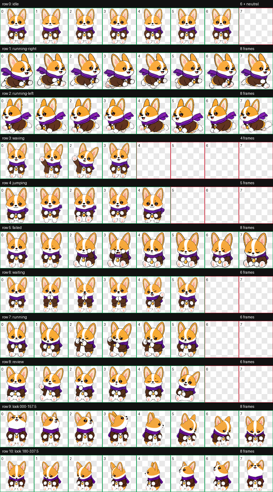

# Gromi Codex Pet

Gromi is a Codex-compatible animated pet based on the Gromi character references: a bright corgi adventurer with large upright ears, orange-and-white markings, a purple scarf, a brown coat, and one lucky amber pendant necklace.

The final pet follows the requested amber design rule: Gromi has exactly one visible amber pendant on the chest, with no floating amber beside the head or ears.



## Contents

- `pet.json` - Codex pet manifest.
- `assets/spritesheet.webp` - final 8x11 transparent animated spritesheet.
- `previews/contact-sheet.png` - overview of the animation frames.
- `previews/look-directions.png` - 16-direction look validation preview.
- `previews/idle.gif` - idle animation preview.
- `previews/failed.gif` - failed animation preview.
- `validation.json` - structural validation output.

## Install Locally

Copy the manifest and spritesheet into your Codex pets folder:

```sh
mkdir -p ~/.codex/pets/gromi
cp pet.json ~/.codex/pets/gromi/pet.json
cp assets/spritesheet.webp ~/.codex/pets/gromi/spritesheet.webp
```

Then restart or reload Codex and select `Gromi` from the pet picker.

## Pet Metadata

```json
{
  "id": "gromi",
  "displayName": "Gromi",
  "spriteVersionNumber": 2,
  "spritesheetPath": "spritesheet.webp"
}
```

## License

This repository is published under the MIT License for the generated pet package in this project.
